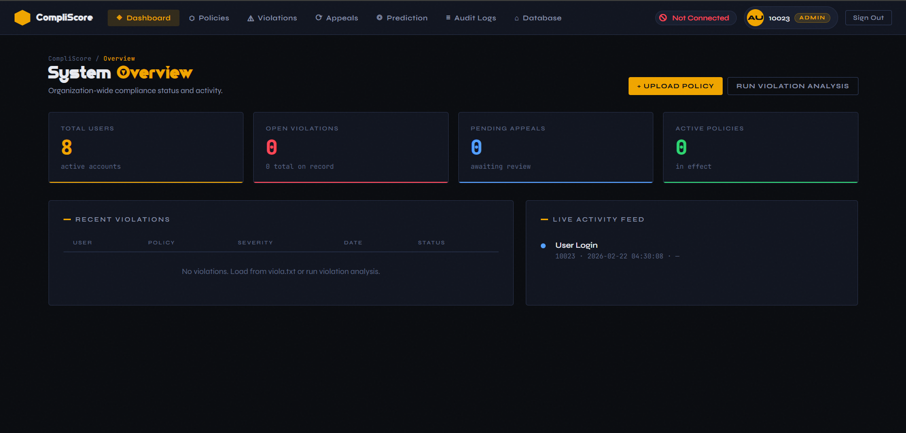
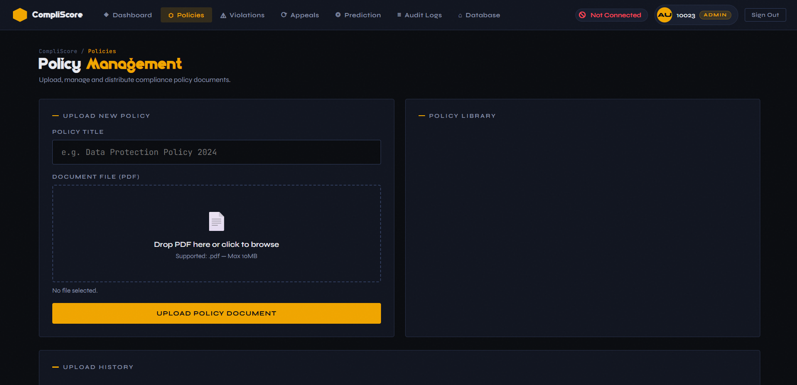
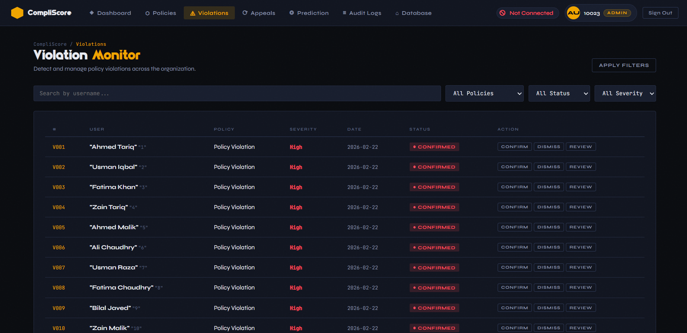
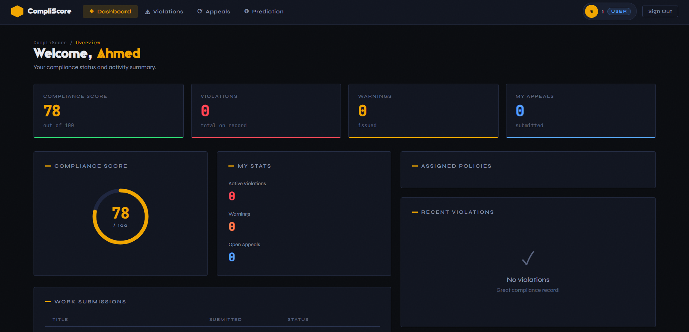
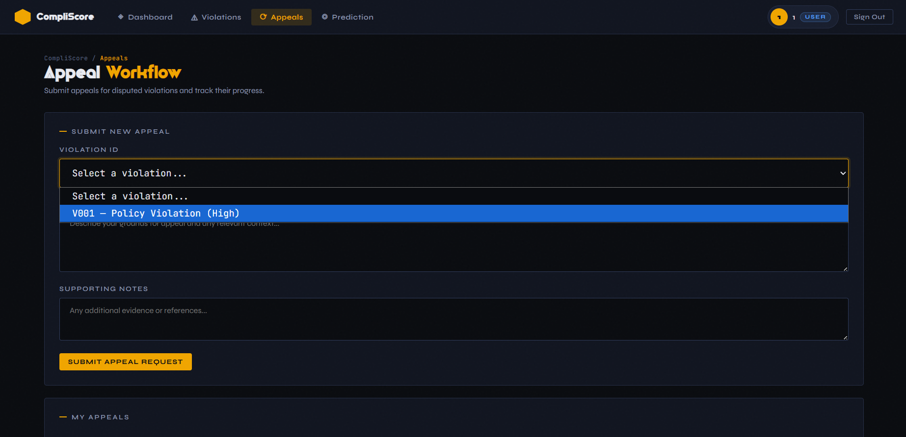
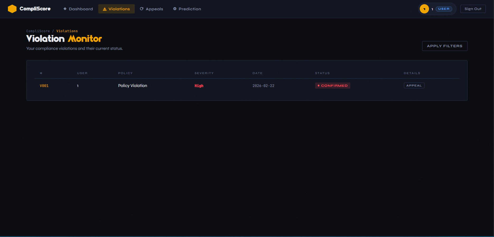

# CompliScore

A compliance monitoring system that reads company policies uploaded by admins, detects employee violations, and predicts whether an employee is likely to violate policies in the future.

---

## Features

- Admin can upload and manage company policies (PDF)
- Automatically checks employee activity against policies
- Reports violations with details
- Predicts future violation likelihood per employee
- Separate dashboards for admins and employees
- Employees can raise appeals against violations

---

## Tech Stack

- **Frontend:** HTML, CSS, JavaScript
- **Backend:** Python, Flask
- **AI:** Google Generative AI (Gemini)

---

## Prerequisites

- Python 3.x
- The following Python packages:
  ```
  flask>=3.0.0
  PyPDF2>=3.0.0
  google-generativeai>=0.8.0
  python-dotenv>=1.0.0
  ```

---

## Installation

1. **Clone the repository**
   ```bash
   git clone https://github.com/your-username/compliscore.git
   cd compliscore
   ```

2. **Install dependencies**
   ```bash
   pip install flask PyPDF2 google-generativeai python-dotenv
   ```

3. **Run the app**
   ```bash
   py app.py
   ```

4. Open your browser and go to `http://localhost:5000`

---

## Screenshots

### Admin Dashboard


### Policy Management


### Appeal Window (Admin)


### Employee Dashboard


### Appeal Window (Employee)


### Violation Window (Employee)
